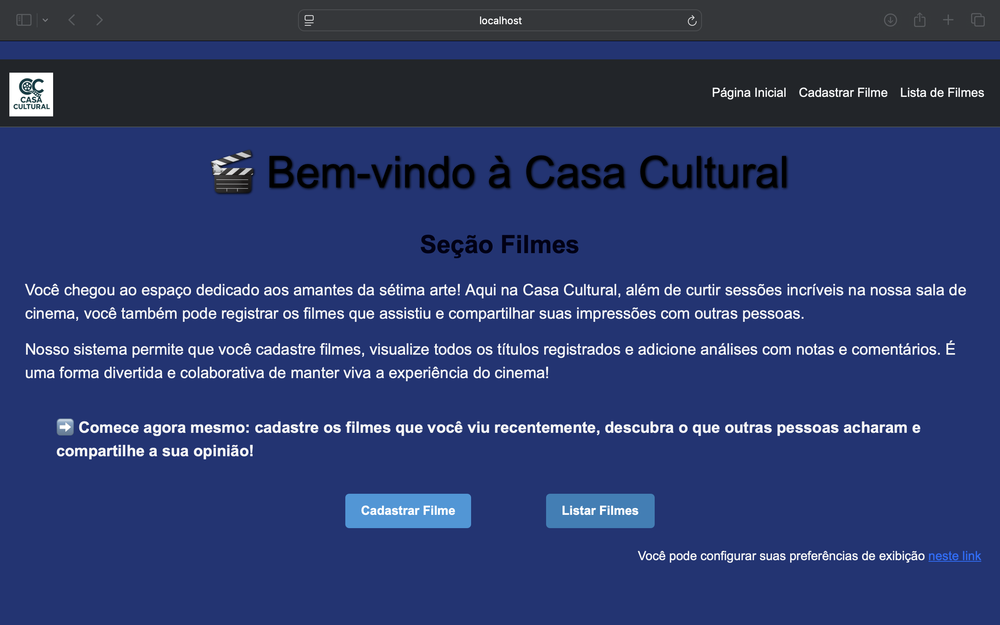
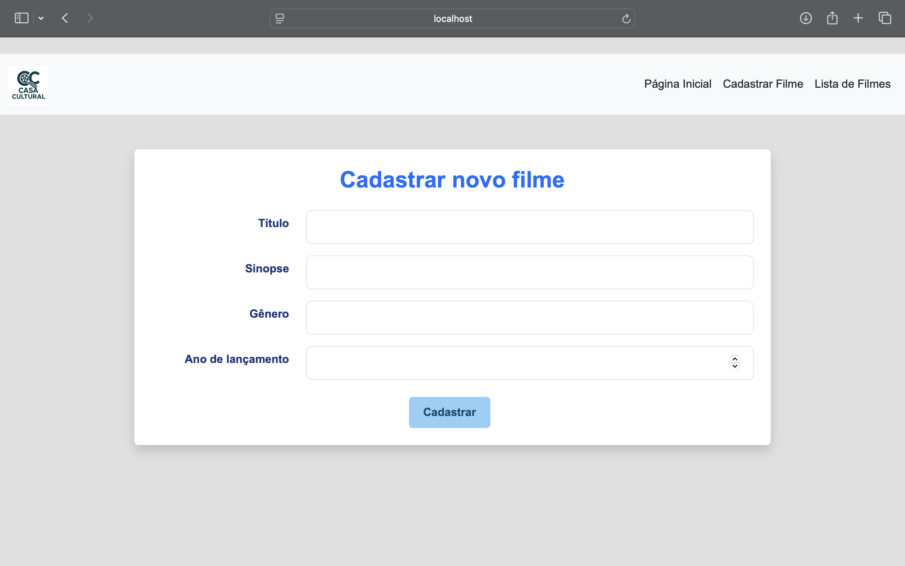
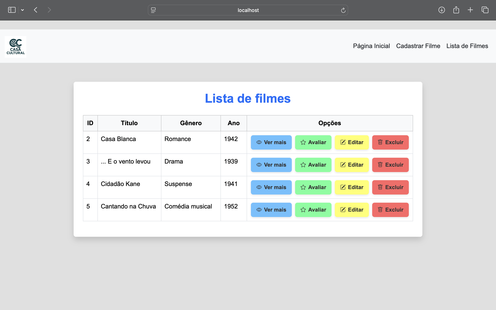
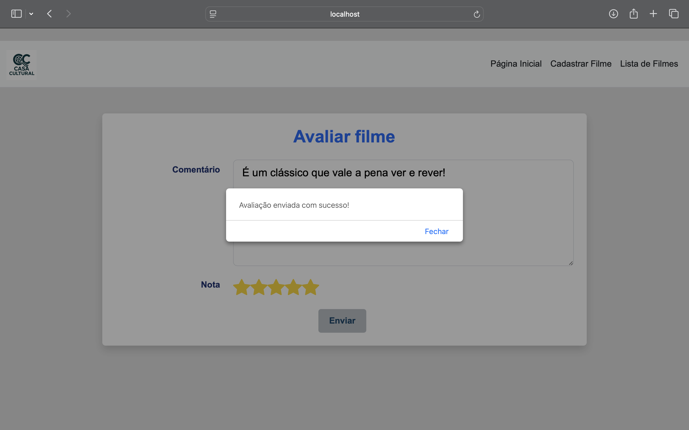
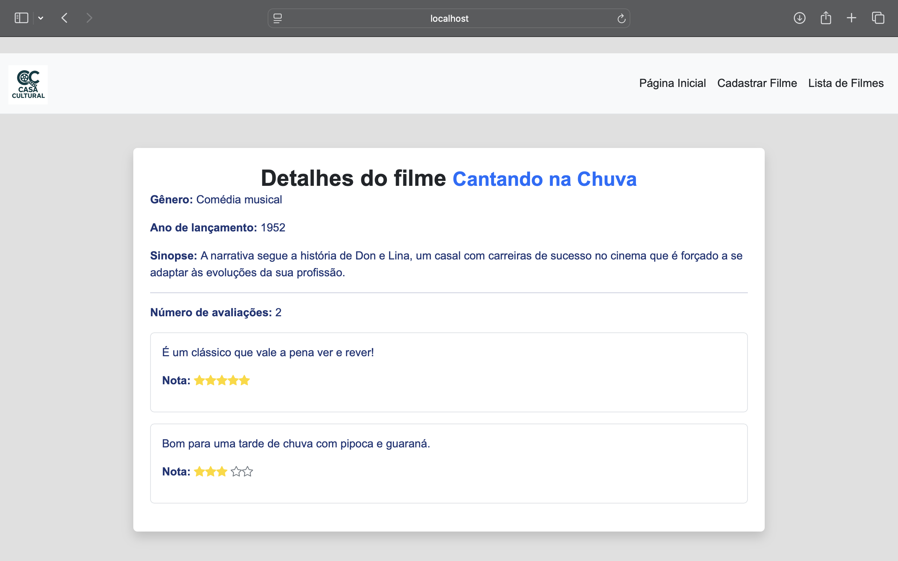

# 🎬 CasaCultural (Gestão de Acervo de Filmes)


> **Projeto Acadêmico:** Desenvolvido no curso **Técnico em Desenvolvimento de Sistemas do Senac-RS**.

## 💻 Sobre o Projeto

O **CasaCultural** é um sistema web desenvolvido para o registro e avaliação de obras cinematográficas. O objetivo é criar um espaço onde usuários possam catalogar filmes assistidos e compartilhar suas análises críticas.

O projeto evoluiu de um protótipo em memória para uma aplicação completa com **persistência de dados em banco relacional**, utilizando arquitetura MVC para renderização das páginas.

### ✨ Funcionalidades
* **🎞️ Cadastro de Filmes:** Registro completo com título, sinopse, gênero e ano.
* **📝 Críticas e Notas:** Sistema de avaliação vinculado a cada filme.
* **🔍 Catálogo Visual:** Listagem organizada dos filmes cadastrados.
* **✏️ Edição:** Possibilidade de atualizar dados de filmes já registrados.

## 📸 Galeria do Projeto

<div align="center">
  <h3>🏠 Tela Inicial</h3>
  

<h3>📂 Gerenciamento do Acervo</h3>
  <p>
    
    
  </p>

<h3>⭐ Avaliação e Detalhes</h3>
  <p>
    
    
  </p>
</div>

## 🛠 Tecnologias Utilizadas

* **Back-end:** Java com Spring Boot (Spring MVC, Spring Data JPA)
* **Front-end:** HTML5, CSS3, JavaScript (Thymeleaf)
* **Banco de Dados:** MySQL
* **Ferramentas:** Maven, Git

## 🚀 Como Executar

### Pré-requisitos
* Java 17 instalado
* MySQL rodando na porta 3306
* Maven

### Passo a passo

1. **Clone o repositório**
   ```bash
   git clone [https://github.com/gracianedev/CasaCultural.git](https://github.com/gracianedev/CasaCultural.git)
   ```

2. **Configure o Banco de Dados**
    * Crie um banco de dados no MySQL chamado `filme`.
    * Na raiz do projeto, crie um arquivo chamado .env (baseado no .env.example) com suas credenciais:
      ```properties
      SPRING_DATASOURCE_URL=jdbc:mysql://localhost:3306/filme
      SPRING_DATASOURCE_USERNAME=seu_usuario
      SPRING_DATASOURCE_PASSWORD=sua_senha
      ```

3. **Execução**
    * Execute o projeto via IDE ou terminal:
      ```bash
      ./mvnw spring-boot:run
      ```
    * Acesse no navegador: `http://localhost:8080`

## 📚 Estrutura do Projeto

* `/src`: Código fonte da aplicação (Controllers, Models, Services).
* `/docs`: Documentação acadêmica e prints do sistema.

## 👩‍💻 Autora

**Graciane**
* [E-mail](mailto:graciane.dev@gmail.com)